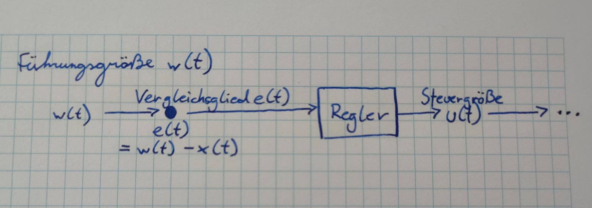
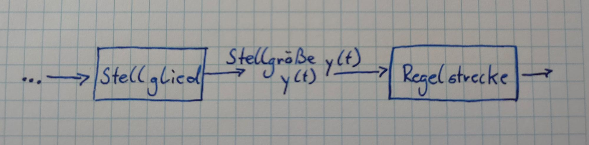
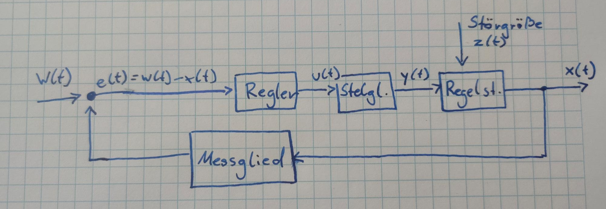
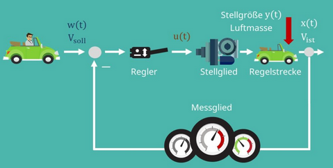

# Übersicht

## Ziele der Regelungstechnik
- Stabilisierung instabiler Strecken
- Verbesserung des Führungsübertragungsverhalten (schnelle, genauer)
- Verbesserung des Störübertragungsverhaltens (Ausregelung von Störgrößen)

## Definition Regeln
Laut Definition handelt es sich um einen Vorgang, bei dem unsere **Regelgröße** durchgehend gemessen und mit unserem eingestellten Wert, der **Führungsgröße**, verglichen wird. Im Anschluss wird die Regelgröße an die Führungsgröße angepasst. Die Regelgröße beschreibt dabei jene Größe, die wir durch die Regelung gezielt konstant oder veränderlich halten wollen.

*Beispiel:* Die Regelungsgröße bei einem Tempomat eines Autos ist beispielsweise die Geschwindigkeit.

## Definition Regelkreis
Das wesentliche Merkmal des Regelkreises ist die **Rückkopplung** von Informationen. Der Unterschied zur Steuerung ist also, dass wir dem System bei der Regelung eine Rückmeldung durch die Rückkopplung geben.
Es findet ein Vergleich von Ist- und Soll-Wert statt. Was das genau bedeutet, erklären wir dir bei Betrachtung des Blockschaltbilds. Gehen wir nun auf die Komponenten und Größen eines Regelkreises ein.

## Definition Stabil
Eine stabile Übertragungsfunktion liegt vor, wenn für alle Eingangssignale < $\infty$, das Ausgangsignal für alle Zeiten < $\infty$ bleibt (und nicht über alle Maßen anklingt.)
$$
\text{BoundenInput}\Rightarrow\text{BoundenOutput}
$$

## Definition Übertragungsfunktion
Siehe [Übertragungsfunktion](./Übertragungsfunktion.md)

# Blockschaltbild
Die Führungsgröße w(t) ist die Größe, an die unsere Regelgröße angepasst werden soll. Sie wird auch als Soll-Wert oder **Eingangsgröße** bezeichnet. Ein einfaches Beispiel für eine Führungsgröße ist die von uns eingestellte Temperatur in einem Raum, zum Beispiel 20 Grad Celsius.

Es folgt das **Vergleichsglied** e(t), welches die Differenz zwischen der Führungsgröße und der Regelgröße berechnet. Also im Falle der Heizung, die Differenz zwischen der eingestellten gewünschten, und der tatsächlichen Temperatur.
$$
e(t) = w(t) - x(t)
$$
zwischen der Führungsgröße und der Regelgröße berechnet. Also im Falle der Heizung, die Differenz zwischen der eingestellten gewünschten, und der tatsächlichen Temperatur.

Diese Differenz ist die Eingangsgröße für unseren **Regler**, welcher eine geeignete **Steuergröße** u(t) berechnet. Um beim Beispiel der Heizung zu bleiben, wäre der Regler also der Computer unserer Heizungsanlage. Die Steuergröße wird nun an das **Stellglied** weitergeben. Stellglieder können in Form von Ventilen, Heizungen oder Motoren vorliegen. Aus diesem resultiert proportional zur Steuergröße die **Stellgröße** y(t). Diese beträgt zwischen 0 und 100 Prozent.

Als nächstes folgt die **[Regelstrecke](./Regelstrecke.md)**. Hierbei handelt es sich um eine mathematische Darstellung der physikalischen Prozessgrößen eines Systems, welches durch die Regeleinrichtung geregelt wird. Um ein System optimal regeln zu können, muss die [Regelstrecke](<[Regelstrecke](./Regelstrecke.md)>) möglichst genau beschrieben werden. Meistens ist diese zeitabhängig. Das heißt, die [Regelstrecke](<[Regelstrecke](./Regelstrecke.md)>) ist der Teil, in welchem die Regelgröße beeinflusst wird. Die mathematische Darstellung kann experimentell ermittelt werden oder über ein mathematisches Modell geschehen.

Auf die [Regelstrecke](<[Regelstrecke](./Regelstrecke.md)>) wirkt eine **Störgröße** z(t) ein. Bei Störgrößen handelt es sich um, von außen einwirkende, Faktoren, welche unsere Regelstrecke unerwünscht beeinflussen. In unserem Beispiel könnte dies ein offenes Fenster im zu beheizbaren Raum sein. Wünschenswert ist ein möglichst geringer Einfluss der Störgröße auf die Regelstrecke. Ist dies gegeben, sprechen wir von einem guten Störverhalten.

Nach der [Regelstrecke](<[Regelstrecke](./Regelstrecke.md)>) erhalten wir jetzt unsere **Regelgröße** x(t), auch Ist-Wert genannt. Diese wollen wir durch die Regelung konstant halten oder gezielt verändern. Ziel ist es, dass die Regelgröße den Wert der Führungsgröße annimmt.

m Gegensatz zu einer Steuerung tritt hier bei der Regelung im Regelkreis eine Rückführung auf. Charakteristisch für jeden Regelkreis ist, dass diese negativ angegeben ist. Daher resultiert das **Minus** am Vergleichsglied im Blockschaltbild. Die Regelgröße wird nach der [Regelstrecke](<[Regelstrecke](./Regelstrecke.md)>) abgegriffen, von einem **Messglied** gemessen und danach in das bereits erwähnte Vergleichsglied rückgeführt. Somit wird die Regelgröße fortlaufend erfasst und mit der Führungsgröße verglichen. Bei einer Steuerung fällt dieser Zweig weg.

# Beispiel

*Tempomat*
Der Fahrer gibt die gewünschte Geschwindigkeit vor, die der Tempomat halten soll. Die vorgegebene Geschwindigkeit ist die Führungsgröße und der Tempomat der Regler.

Der mit dem Tempomat verbundene Bordcomputer berechnet den Öffnungswinkel der Drosselklappe. Der Öffnungswinkel stellt dabei die Steuergröße und die Drosselklappe das Stellglied dar. Über diese kann das benötigte Drehmoment eingestellt werden.

Die resultierende Luftmasse gelangt in den Motor und das Drehmoment wird erzeugt. Zusammen mit dem Motor stellt das Fahrzeug die Regelstrecke dar.

Als Störgrößen kommen beispielsweise der Luftwiderstand und der Steigungswiderstand zum Tragen.

Die austretende Regelgröße ist die Fahrzeuggeschwindigkeit, die zum einen auf unserem Tacho angezeigt wird und zum anderen an den Tempomat zurückgeht.

